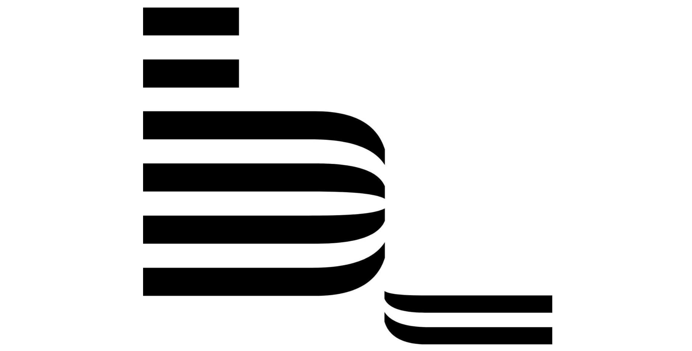

# Pengenalan Metodologi CSS

## Apa itu metodologi ?

**Metodologi** adalah Metodologi adalah ilmu atau sistem tentang metode. Memikirkan metode hanya sebagai cara untuk melakukan sesuatu secara sistematis, dengan cara yang telah ditetapkan tertentu melakukan hal-hal untuk mencapai hasil yang kita inginkan.

## Apa itu metodologi CSS ?

**Metodologi CSS** dapat diartikan yaitu metode atau tata cara penulisan dalam pembuatan CSS agar lebih **Fleksibel**, **Terdefinisi**, **Dapat dipahami**, dan **Dapat dikelola kembali**.

Terdapat berbagai **Metodologi CSS** yang dibahas pada kali ini, diantarannya : 

### OOCSS (Object Oriented CSS)

**OOCSS** adalah metode yang dikembangkan oleh Nicole Sullivan pada tahun 2008, konsep kunci OOCSS (Object Oriented CSS) mencakup identifikasi objek CSS , pemisahan struktur dan gaya visual, dan menghindari gaya berbasis lokasi.

Di sini ada dua jenis objek, pratinjau judul yang lebih besar yang akan diberi nama `post-preview-primary` dan bilah sisi dengan judul yang akan diberi nama `post-preview-secondary`.

Perlu memisahkan struktur dan kulit (yaitu gaya yang menciptakan penampilan objek). Kedua jenis objek memiliki struktur yang berbeda, yang satu berada dalam kotak yang lebih besar meskipun terlihat serupa, dengan gambar di sebelah kiri dan judul di kanan.

* **Pro OOCSS** : Kode styling visual yang dapat digunakan kembali, kode fleksibel lokasi, pengurangan pemilih dalam bersarang.
* **Kontra OOCSS** : Tanpa jumlah yang cukup mengulangi pola visual, memisahkan struktur dan kode gaya visual tampaknya tidak perlu.

* **Pengembang OOCSS -** [https://github.com/stubbornella](https://github.com/stubbornella)
* **Official Website -** [http://oocss.org/](http://oocss.org/)
* **Dasar OOCSS -** [https://toddmotto.com/getting-started-with-object-orientated-css-oocss-creating-a-button-kit/](https://toddmotto.com/getting-started-with-object-orientated-css-oocss-creating-a-button-kit/)

### BEM (Block, Element, Modifier)

**BEM** adalah Sebuah "Block" pada dasarnya sama dengan "objek" (dari contoh sebelumnya), sebuah "Element" mengacu pada komponen blok (gambar, judul, Preview dalam objek di atas `preview-post-`). Sebuah "Modifier" dapat digunakan ketika keadaan blok atau elemen berubah, misalnya ketika Anda menambahkan kelas aktif ke item menu untuk menyorotnya, kelas aktif bertindak sebagai pengubah / Modifier.

Situs **BEM** juga mencantumkan **bagaimana blok**, **elemen**, **dan segregasi pengubah juga dapat dimasukkan ke dalam sistem file CSS** . Blok seperti "tombol" dan "input" dapat memiliki folder mereka sendiri yang terdiri dari file (.css, .js) yang terkait dengan blok tersebut, yang membuat semuanya lebih mudah ketika kita ingin mengimpor blok tersebut dalam proyek lain.

* **Pro BEM** : Mudah untuk menggunakan nama kelas dan mengurangi pemilih dalam CSS.
* **Kontra KONTRA** : Untuk menjaga nama-nama yang terlihat kurang bagus, BEM menyarankan agar kita terus memblokir ke elemen yang dangkal.

* **Official Website -** [https://en.bem.info/](https://en.bem.info/)
* **Dasar BEM -** [https://www.sitepoint.com/css-architecture-block-element-modifier-bem/](https://www.sitepoint.com/css-architecture-block-element-modifier-bem/)
* **Youtube -** [https://www.youtube.com/watch?v=Ysf0LhP8jus](https://www.youtube.com/watch?v=Ysf0LhP8jus)
* **css-tricks -** [https://css-tricks.com/bem-101/](https://css-tricks.com/bem-101/)

### SMACSS (Scalable dan Modular Architecture for CSS)

Dikembangkan pada tahun 2011 oleh Jonathan Snook **SMACSS (Scalable dan Modular Architecture for CSS)** bekerja dengan mengidentifikasi 5 jenis aturan gaya yang berbeda. Nama kelas dan sistem pengarsipan dibuat berdasarkan ini.

**SMACSS** adalah cara untuk memeriksa proses desain Anda dan sebagai cara untuk menyesuaikan kerangka kerja yang kaku ke dalam proses pemikiran yang fleksibel. - Jonathan Snook

SMACSS mengidentifikasi 5 jenis aturan gaya yaitu dasar, tata letak, modul, status , dan tema .

* Gaya dasar adalah gaya default diarahkan pada tag HTML dasar seperti `
`, `<a:link>`.
* Gaya tata letak adalah gaya yang digunakan untuk menentukan tata letak laman, seperti pengkodean tempat menu header, footer, dan samping akan terbuka.
* Gaya modul khusus untuk modul seperti galeri atau tampilan slide.
* Gaya keadaan untuk menyorot elemen dengan status yang dapat diubah seperti disembunyikan atau dinonaktifkan.
* Tema digunakan untuk mengubah skema visual halaman.

* **Pro SMACSS** : Kode terorganisir yang lebih baik.
* **Kontra SMACSS** : Tidak ada yang bisa saya pikirkan.

* **Official Website -** [https://smacss.com/](https://smacss.com/)
* **css-tricks -** [https://css-tricks.com/smacss-press/](https://css-tricks.com/smacss-press/)
* **Mengorganisasi CSS dengan SMACSS -** [https://www.ariona.net/mengorganisasi-css-dengan-smacss/](https://www.ariona.net/mengorganisasi-css-dengan-smacss/)