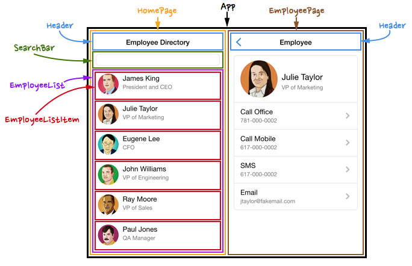

# Component



## Penjelasan Component

**Component** merupakan sebuah bagian kecil dari suatu halaman yang apabila disatukan dengan component lain akan membentuk sebuah halaman utuh, pada contoh gambar diatas ada beberapa contoh component misalnya `Header`, `SearchBar`, `EmployeeList`, `EmployeeListItem`, `App` dan sebagainya. Masing - masing component kecil diatas memiliki logic dan perannya sendiri, yaitu :

1.  **Header** berperan untuk menampilkan judul halaman
2.  **SearchBar** berperan untuk melakukan pencarian
3.  **EmployeeList** berperan untuk menerima data daftar pegawai
4.  **EmployeeListItem** menerima data daftar pegawai dari `EmployeeList` dan merender tampilan perbaris
5.  **App** membungkus semua komponen tersebut

Kelebihan lain dari component yaitu **component bisa digunakan pada banyak halaman** tanpa mengganti struktur kodenya (**Reuseable**), misalnya component `searchBar` bisa digunakan untuk melakukan pencarian data apapun, sehingga bisa diterapkan di halaman apapun.

## Cara Membuat Component

Untuk membuat component dalam react, kita bisa menggunakan tiga cara, yaitu :

**Menggunakan class :**

```Javascript
import React, {Component} from 'react'

export default class Header extends Component {
  render() {
    return (
      <h1>Judul Halaman</h1>
    )
  }
}
```

**Menggunakan method `React.createClass`:**

```Javascript
const Header = React.createClass({
  render() {
    return (
      <h1>Judul Halaman</h1>
    );
  }
});

export default Header
```

**Menggunakan function :**

```Javascript
const Header = () => {
  return (
    <h1>Judul Halaman</h1>
  )
}

export default Header
```

## Merubah Halaman Website Menjadi Component

Cara efektif untuk belajar tentang component di react yaitu dengan mengubah sebuah halaman website yang semula jadi satu menjadi beberapa component - component kecil
